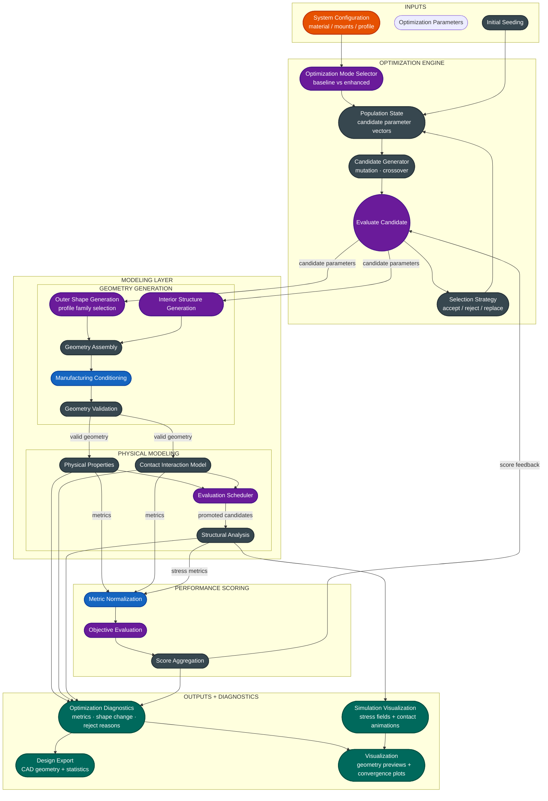

# Architecture: Weapon Designer Permutation Space

The weapon-designer optimisation stack is built from five independent
**swap points** — design dimensions that can be configured independently
via `OptimizationParams` fields.  This document lists each slot, its
interface contract, all current implementations, and which config key
controls the selection.

---

## Swap-Point Table

| Slot | Interface contract | Implementations | Config key |
|------|--------------------|-----------------|------------|
| **Profile** | `(radii, cfg) → Polygon\|None` | `fourier`, `bspline`, `bezier`, `catmull_rom` | `profile_type` |
| **Cutout / Phase 2** | `(polygon, cfg, case_dir) → weapon + cutouts` | `fourier` (ellipse pairs), `superellipse` (polar DE), `topology` (SIMP) | `cutout_type` |
| **Objective** | `(poly, cfg) → dict` | `baseline` (formula bite + geom proxy), `enhanced` (spiral bite + FEA) | `evaluation_mode` |
| **Optimizer** | `(cfg, case_dir) → dict` | `baseline` DE, `enhanced` DE | `evaluation_mode` |
| **FEA** | `(poly, cfg) → dict` | `off` (geom proxy), `coarse` (10 mm), `fine` (4 mm) | `fea_interval`, `fea_*_spacing_mm` |
| **Contact loads** | `(contacts) → list[dict]` | off (centrifugal only), `spiral_contact` (tangential impact forces) | pass `contact_forces=` to FEA |

---

## Profile Slot

Outer-profile generators all live in `src/weapon_designer/`.  The
dispatcher `profile_builder.build_profile()` routes to the correct
implementation based on `cfg.optimization.profile_type`.

| Key | Module | Class/function | Continuity | Notes |
|-----|--------|----------------|-----------|-------|
| `fourier` | `parametric.py` | `build_weapon_polygon()` | C∞ | Baseline — frozen, not used in enhanced mode |
| `bspline` | `bspline_profile.py` | `build_bspline_profile()` | C² | Default enhanced; scipy splprep periodic |
| `bezier` | `profile_splines.py` | `build_bezier_profile()` | C¹ | Composite cubic; CR-style tangents |
| `catmull_rom` | `profile_splines.py` | `build_catmull_rom_profile()` | C¹ | Interpolates control points; centripetal α=0.5 |

All three spline families use the same DE bounds: `n_bspline_points × (r_min, r_max)`.

## Cutout / Phase-2 Slot

Weight-reduction strategies:

| Key | Module | Method | Symmetry | Mass enforcement |
|-----|--------|--------|---------|-----------------|
| `fourier` | `parametric.py` | Ellipse pairs at mirrored angles | N-fold applied | Via mass score in objective |
| `superellipse` | `parametric_cad.py` | `(r, φ, a, b, n)` polar superellipse, DE search | None (free per-hole positions) | Analytic normalization post-DE |
| `topology` | `topo_optimizer.py` | SIMP continuum optimisation, OC update | None (continuum field) | Volume-fraction constraint (OC bisection) + adaptive threshold |

The `topology` implementation differs structurally from the other two: it is
not a parametric search but a gradient-based density field update.  Phase 2 is
entirely replaced by the SIMP loop; `num_cutout_pairs` and polar bounds are
ignored when `cutout_type = "topology"`.

## Objective Slot

| Key | Module | Bite model | Structural |
|-----|--------|-----------|-----------|
| `baseline` | `objectives.py` | Formula constant per style/RPM; geometry cannot influence it | Geometric proxy (wall thickness, section width) |
| `enhanced` | `objectives_enhanced.py` | Kinematic Archimedean spiral simulation; n_contacts × r_profile crossings per revolution | Coarse FEA safety factor in-loop |
| `physical` | `objectives_physical.py` | Same spiral bite; score = E_transfer/E_ref ∈ [0,1]; no soft weights | Hard constraints: SF≥1.5, mass≤budget, CoM≤3%R; returns 0 on violation |

Bite scoring difference:

| Mode | Formula | Target |
|------|---------|--------|
| baseline | `1 − |bite − 20 mm| / 20 mm` | Fixed 20 mm ideal |
| enhanced | `bite_mm / max_bite_mm` | Monotone; maximise fraction of theoretical maximum |

## FEA Slot

Controlled by `fea_interval` (0 = off) and mesh-spacing fields:

| Mode | `fea_interval` | Mesh spacing | Cost |
|------|---------------|-------------|------|
| Off | `0` | — (geom proxy used) | lowest |
| Coarse | > 0 | `fea_coarse_spacing_mm` = 10.0 mm | moderate (~50–100 ms) |
| Fine | > 0 | `fea_fine_spacing_mm` = 4.0 mm | high (~200–500 ms) |

FEA loading: centrifugal body load + optional tangential contact forces from
`spiral_contact.contact_forces()`.  Contact forces are the tangent to the spiral
path at each contact point: `dP/dθ = (−v_per_rad·cos θ − r·sin θ,  −v_per_rad·sin θ + r·cos θ)`.

## Contact Loads Slot

`spiral_contact.analyse_contacts(poly, n_spirals, v_ms, rpm)` returns a
`ContactResult` per spiral.  `contact_forces(contacts, force_magnitude_n)`
converts these to `{x, y, fx, fy}` dicts passed to `fea_stress_analysis_with_mesh`.

This slot is not yet wired into the optimizer loop; it is used for post-hoc
FEA analysis and the `docs/figure_spiral_contacts.py` visualization.

---

## Permutation Matrix (valid combinations)

| Profile | Phase-2 cutout | Objective | FEA | Contact loads | Description |
|---------|--------|-----------|-----|--------------|-------------|
| `fourier` | `fourier` | `baseline` | off | off | **Original baseline** (frozen) |
| `bspline` | `superellipse` | `enhanced` | coarse | off | **Enhanced default — polar cutouts** |
| `bspline` | `topology` | `enhanced` | coarse | off | **Enhanced — SIMP topology (recommended)** |
| `bezier` | `superellipse` | `enhanced` | coarse | off | Bézier profile variant |
| `bezier` | `topology` | `enhanced` | coarse | off | Bézier profile + topology |
| `catmull_rom` | `superellipse` | `enhanced` | coarse | off | Catmull-Rom variant |
| `catmull_rom` | `topology` | `enhanced` | fine | off | High-quality topology GIF mode |
| any spline | `superellipse` | `enhanced` | fine | spiral | Post-hoc contact stress analysis |
| `bspline` | `topology` | `enhanced` | coarse | off | **Topology Phase 2 default** |
| `bspline` | `topology` | `enhanced` | fine | spiral | Topology + contact loads (high-quality) |
| `bspline` | `fourier` | `enhanced` | off | off | B-spline + legacy cutouts (fast) |

Combinations marked "frozen" must not be modified (research-paper baseline).
"Contact loads" column refers to passing `contact_forces` to a post-hoc FEA call;
it does not affect the optimizer loop.

Topology mode ignores `num_cutout_pairs`, `phase2_iters`, and all polar-cutout
bounds.  Its iteration budget is controlled by `topo_n_iter` instead.

---

## ROM / Surrogate Track (Track 3)

Separate from the optimizer loop; builds a POD/GP surrogate for FEA speed-up.

| Script | Purpose | Key output |
|--------|---------|-----------|
| `scripts/build_fea_database.py` | Sobol sampling → N FEA calls → reference-mesh stress fields | `fea_database/{design_NNNN.npz, ref_mesh.npz, manifest.json}` |
| `scripts/build_rom.py` | SVD/POD → k GP regressors | `fea_database/fea_surrogate.pkl` |
| `scripts/validate_rom.py` | LOO CV, calibration, 1D slices | `fea_database/validation_summary.json` |
| `src/weapon_designer/surrogate_fea.py` | `FEASurrogate` class: fit/predict/save/load | — |
| `src/weapon_designer/optimizer_surrogate.py` | UCB active-learning optimizer | `surrogate_stats.json` |

**Empirical results (N=500, d=8 B-spline params, M=1173 reference elements):**

| Threshold | k modes | Fit time | Peak stress LOO err | Calib R² |
|-----------|---------|---------|---------------------|----------|
| 95%       | 63      | 20 min  | 17.9%               | −0.66    |
| 99%       | 187     | 54 min  | 14.5%               | −2.33    |

Modes beyond k≈63 have near-zero singular values (numerical noise).
**Recommended**: 90% threshold (k≈30) for active-learning production use.
All scores in the N=500 Sobol database are 1.0 (thin-ring shapes saturate E_score);
the physical score has zero variance at random parameter samples. To expose score
variance for active learning, seed with constraint-boundary designs (low SF, mass near limit).

---

## Data Flow Diagram

### Optimizer loop (enhanced mode, one evaluation)

```
WeaponConfig
    │
    ├─ optimization.profile_type ──────────────────────────────────┐
    ├─ optimization.phase1_iters / phase2_iters                    ↓
    │                                              profile_builder.build_profile()
    │                                                 ├─ bspline_profile.py   (C²)
    │                                                 ├─ profile_splines.py   (bezier, C¹)
    │                                                 └─ profile_splines.py   (catmull_rom, C¹)
    │                                                               │ outer Polygon
    ├─ optimization.cutout_type ───────────────────────────────────┐│
    │                                                               ↓↓
    │                                    ┌─ "superellipse" ─────────────────────────────────────┐
    │                                    │  parametric_cad.make_cutouts_polar()                 │
    │                                    │  (analytic mass normalization applied post-DE)        │
    │                                    │                           │ list[Polygon]             │
    │                                    └───────────────────────────┘                          │
    │                                    ┌─ "topology" ─────────────────────────────────────────┐
    │                                    │  topo_optimizer.topology_optimize()                  │
    │                                    │    mesh solid polygon → ρ_e per element              │
    │                                    │    SIMP loop: K(ρ)u=F → sensitivities → OC update   │
    │                                    │    adaptive threshold → void union → smooth           │
    │                                    │    → weapon_polygon + cutout_polygons                │
    │                                    │    → frames_topo/ + frames_topo_binary/ + fea/       │
    │                                    │    → 3× GIF + topo_convergence.png                   │
    │                                    └───────────────────────────┘                          │
    │                                                               ↓
    │                                            geometry.assemble_weapon()
    │                                              (outer − mounting bore − bolt holes − cutouts)
    │                                                               │ weapon Polygon
    │                                                               ↓
    ├─ evaluation_mode = "enhanced" ───────────────────────────────┤
    │                                              objectives_enhanced.compute_metrics_enhanced()
    │                                                 ├─ physics: mass, MOI, stored energy
    │                                                 ├─ kinematic_spiral_bite()
    │                                                 │    r_enemy = r_start − v_per_rad·θ
    │                                                 │    n_contacts = profile crossings / rev
    │                                                 │    bite = v_per_rad·2π / n_contacts
    │                                                 ├─ detect_teeth() — supplementary logging
    │                                                 └─ fea.fea_stress_analysis()
    │                                                      centrifugal body load only
    │                                                               │ metrics dict
    │                                                               ↓
    │                                            objectives_enhanced.weighted_score_enhanced()
    │                                                               │ score (float) → DE
    │                                                               ↓
    └─ fea_interval > 0 ───────────────────────────────────────────┤
                                               optimizer_enhanced._FEACallback.__call__()
                                                 ├─ fea_viz.render_fea_frame() → frame_NNNN.png
                                                 ├─ np.savez_compressed()      → frame_NNNN.npz
                                                 └─ json.dumps()               → frame_NNNN_meta.json
                                                               │
                                                               ↓
                                              fea_viz.export_gif()  →  convergence_phase*.gif
```

### Post-hoc spiral contact FEA (separate analysis, not in optimizer loop)

```
weapon Polygon  (optimized result or any profile)
    │
    ├─ spiral_contact.analyse_contacts(poly, n_spirals, v_ms, rpm)
    │       for each θ₀ ∈ [0, 2π):
    │         r_enemy(θ) = r_start − v_per_rad·(θ − θ₀)
    │         find first θ where r_enemy ≤ r_profile(θ)
    │         → ContactResult: r_contact, xy_contact, bite_depth, force_direction
    │                          force_direction = dP/dθ / |dP/dθ| (spiral path tangent)
    │
    ├─ spiral_contact.contact_forces(contacts, force_magnitude_n)
    │       → list[{x, y, fx, fy}]  (tangential impact loads)
    │
    └─ fea.fea_stress_analysis_with_mesh(poly, ..., contact_forces=forces)
            centrifugal body load  +  contact point forces (nearest-node KDTree)
            → nodes, elements, vm_stresses, safety_factor
```

### GIF replay (post-hoc, no optimizer required)

```
runs/<id>/frames_p1/frame_NNNN.npz + frame_NNNN_meta.json
    │
    └─ fea_replay.py <frames_dir> [--output PATH] [--fps N] [--vmax F]
            reconstruct Polygon from polygon_xy / holes_xy
            fea_viz.render_fea_frame() with optional vmax override
            fea_viz.export_gif()  →  replay.gif
```

### Topology optimisation data flow (Phase 2, `cutout_type = "topology"`)

```
outer Polygon  (from Phase 1)  +  WeaponConfig
    │
    └─ topo_optimizer.run_topology_optimisation(poly, cfg, case_dir)
         │
         ├─ triangulate_polygon(spacing=topo_mesh_spacing_mm)
         │     → nodes (N×2), elements (M×3)
         │
         ├─ assemble_stiffness(K)  ← computed once, reused every SIMP iter
         │
         ├─ SIMP loop (topo_n_iter iterations):
         │     F_centrifugal = centrifugal_load(nodes, elements, ω, ρ, t)
         │     u = K_eff(ρ)⁻¹ F            (solve with penalised E_eff)
         │     ∂J/∂ρ_e = compliance sensitivity + MOI sensitivity
         │     ρ_new = OC_update(ρ, ∂J/∂ρ, V_f)
         │     ρ_filtered = density_filter(ρ_new, r_min)
         │     ── every topo_frame_interval steps ──
         │     save frames_topo/, frames_topo_binary/, frames_topo_fea/
         │
         ├─ adaptive_threshold(ρ_final, V_f)  → binary mask
         │
         └─ void_polygons = extract_voids(elements[mask==0], nodes)
              weapon_final = outer_polygon.difference(void_polygons.buffer(δ))
              → weapon Polygon  (replaces parametric cutouts)
```

### fea_speed_sweep.py — RPM sweep data flow

```
weapon.dxf  +  stats.json
    │
    ├─ load_polygon_from_dxf()         → Shapely Polygon
    ├─ triangulate_polygon()           → nodes, elements   ← done once
    ├─ assemble_stiffness()            → K                 ← done once
    │
    └─ for rpm in [rpm_min … rpm_max]:
          ω = rpm × 2π/60
          F_cent  = centrifugal_load(nodes, elements, ω, ρ, t)
          u_cent  = K⁻¹ F_cent
          vm_cent = von_mises(nodes, elements, u_cent)
          │
          contacts = spiral_contact(poly, ω, v_approach)
          │   ← all crossings of Archimedean spiral with radial profile
          │   ← returns list[(angle_rad, r_mm)] for one revolution
          │
          F_imp = impact_load(nodes, contacts, F_total/n_contacts)
          │   ← total force ½mω²r̄; split equally across n_contacts points
          │   ← direction: (sin θ, −cos θ) opposing CCW rotation at each site
          │
          u_comb  = K⁻¹ (F_cent + F_imp)
          vm_comb = von_mises(nodes, elements, u_comb)
          → SliceResult(rpm, vm_centrifugal, vm_combined, contacts, …)
    │
    └─ plot_3d_sweep(nodes, elements, results)
          3-D Poly3DCollection stack  (Z = RPM)
          safety-factor curves  +  peak-stress curves
          worst-case 2-D heatmap  +  operating-range summary table
          → speed_sweep.png
```

### Sidecar file format (per frame)

| File | Contents |
|------|---------|
| `frame_NNNN.png` | Rendered two-panel FEA stress map |
| `frame_NNNN.npz` | `nodes` (N×2), `elements` (M×3), `vm_stresses` (M,), `polygon_xy` (K×2), `holes_xy` (H×2, NaN-separated) |
| `frame_NNNN_meta.json` | step, phase, score, metrics dict, cfg_snapshot |

Sidecar files enable `fea_replay.py` to re-assemble GIFs post-hoc with
different colourscales or DPI, and to perform statistical analysis of the
stress field over the convergence trajectory without re-running the optimizer.

---

## Adding a New Profile Type

1. Implement `build_my_profile(radii, max_radius_mm, min_radius_mm, n_eval) → Polygon | None`
   in a new or existing module.
2. Add a branch to `profile_builder.build_profile()` for the new key string.
3. Add `profile_type = "my_profile"` to any JSON config file.
4. No other files need changes — the optimizer uses the dispatcher.

## Adding a New Parametric Cutout Type

1. Implement `make_cutouts_mytype(params, C) → list[Polygon]` and
   `get_cutout_bounds_mytype(cfg) → list[tuple]` in a new module.
2. Add a branch in `optimizer_enhanced.py` where cutout bounds and builder
   are selected (search for `get_cutout_bounds_polar`).
3. Add `cutout_type = "mytype"` to the config.

> **Note:** `topology` is a special case — it bypasses the cutout-placement loop entirely and
> calls `topo_optimizer.run_topology_optimisation()` directly from `optimizer_enhanced.py`.
> It does not follow the `make_cutouts_mytype / get_cutout_bounds_mytype` pattern.

## Tuning the Topology Optimiser

The topology optimiser's behaviour is driven by three key parameters:

| Parameter | Effect | Typical range |
|-----------|--------|--------------|
| `topo_w_compliance` | Higher → more load-following spokes; lower → more rim mass | 0.2 – 0.8 |
| `topo_p_simp` | Higher → crisper black/white convergence (less grey); may trap in local min | 2 – 5 |
| `topo_r_min_factor` | Higher → smoother holes, fewer thin slivers; lower → finer detail | 1.5 – 4.0 |

For a pure **MOI-maximising** design (large uniform rim, hollow centre), use
`topo_w_compliance = 0.1`.  For a **stress-driven** design (spokes aligned with
centrifugal load paths), use `topo_w_compliance = 0.8`.

The `topo_fix_rim = true` flag ensures a continuous outer ring; disable it only
if the outer profile already has strong teeth that can carry load without a rim.

## Adding Contact Forces to a Custom FEA Run

```python
from weapon_designer.spiral_contact import analyse_contacts, contact_forces
from weapon_designer.fea import fea_stress_analysis_with_mesh

# 1. Get contact results for a family of approach spirals
contacts, r_start = analyse_contacts(poly, n_spirals=20, v_ms=10.0, rpm=cfg.rpm)

# 2. Convert to FEA point forces (tangent to spiral path, 1 kN per contact)
forces = contact_forces(contacts, force_magnitude_n=1000.0)

# 3. Run FEA with centrifugal + contact loads superimposed
result = fea_stress_analysis_with_mesh(
    poly,
    rpm=cfg.rpm,
    density_kg_m3=cfg.material.density_kg_m3,
    thickness_mm=cfg.sheet_thickness_mm,
    yield_strength_mpa=cfg.material.yield_strength_mpa,
    bore_diameter_mm=cfg.mounting.bore_diameter_mm,
    mesh_spacing=cfg.optimization.fea_fine_spacing_mm,
    contact_forces=forces,
)
```

Force direction convention: `force_direction` in each `ContactResult` is the
unit tangent to the Archimedean spiral path at the contact point —
`dP/dθ = (−v_per_rad·cos θ − r·sin θ,  −v_per_rad·sin θ + r·cos θ)` normalised.
This represents the velocity of the opponent in the weapon's rotating frame;
by Newton's 3rd law the weapon experiences a force in this direction.


# Mermaid plot (architecture summary for report)

